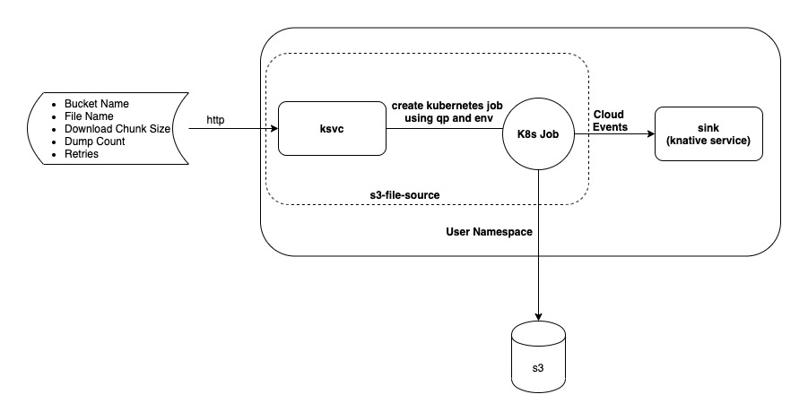

# S3 File Source 

Emit lines of flat files stored in s3 based object storage as cloud events.

[](https://goreportcard.com/report/github.com/itsmurugappan/s3-flat-file-source)
<a href='https://github.com/jpoles1/gopherbadger' target='_blank'></a>




## About

S3 File Source is kubernetes job dynamically created by [Job Trigger ksvc](https://github.com/itsmurugappan/job-trigger). 

## Configuration

Following are the configuration options for the file source. These values can be statically mentioned 
as a environment variable or as a query parameter to the job trigger knative service.

1. S3_URL
2. S3_BUCKET
3. S3_REGION
4. S3_ACCESS_KEY
5. S3_SECRET_KEY
6. S3_FILE_NAME
7. CHUNK_SIZE - Bytes to be downloaded each time from s3 (Default - 50mb)
8. SINK_DUMP_COUNT - Number of lines to be sent to the sink in one request (Default - 100)
9. SINK_RETRY_COUNT - Number of times to retry on failure (Default - 3)
10. SINK_RETRY_INTERVAL - Seconds to wait before next retry (Default - 1)

## Example

Please check out the [example](./examples) page on how to use s3 file source

## Sample S3 File source

```
apiVersion: serving.knative.dev/v1
kind: Service
metadata:
  name: s3-file-source-svc
  namespace: demo
spec:
  template:
    spec:
      containers:
      - env:
        - name: JOB_SPEC
          value: "{\"Image\": \"murugappans/s3-file-source:v1\",\"Name\": \"s3-file-source-job\", \"EnvFromSecretorCM\": [{\"Name\": \"s3-access\",\"Type\": \"Secret\"}]}"
        image: murugappans/job-trigger:v1
```

### Limitation

Currently the file processing is sequential, I am working on making it parallel.
